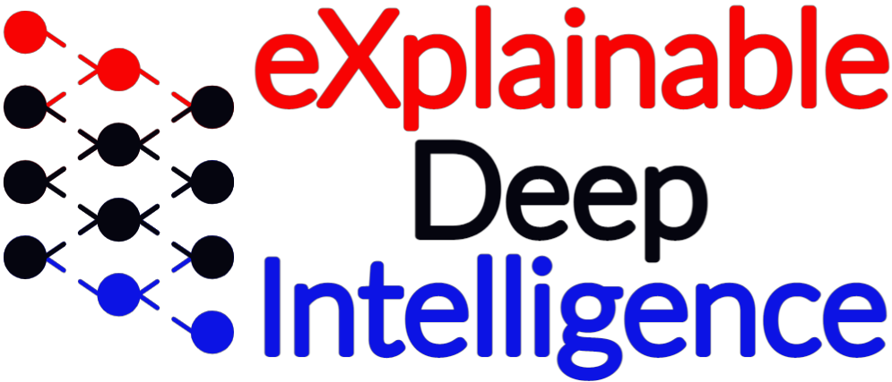

<a id="readme-top"></a>

<!-- PROJECT SHIELDS -->

[![Contributors][contributors-shield]][contributors-url]
[![Issues][issues-shield]][issues-url]
[![project\_license][license-shield]][license-url]
[![Android][android-shield]][android-url]
[![Kotlin][kotlin-shield]][kotlin-url]
[![Unity][unity-shield]][unity-url]

<!-- PROJECT LOGO -->

<br />
<div align="center">
  <a href="https://github.com/xdilab/VR_Tablet">
    
  </a>

<h3 align="center">Sundown – Tablet Module</h3>

  <p align="center">
    This repository contains the Tablet component of the Sundown research platform. The Tablet application serves as an external remote control that mirrors the video playback controls of the VR headset, allowing a researcher or assistant to play, pause, and manage video playlists on behalf of the VR user.
    <br />
    <a href="https://github.com/xdilab/VR_Tablet"><strong>Explore the docs »</strong></a>
    <br />
    <br />
    <a href="https://github.com/xdilab/VR_Tablet/issues/new?labels=bug">Report Bug</a>
    &middot;
    <a href="https://github.com/xdilab/VR_Tablet/issues/new?labels=enhancement">Request Feature</a>
  </p>
</div>

<!-- TABLE OF CONTENTS -->

<details>
  <summary>Table of Contents</summary>
  <ol>
    <li>
      <a href="#about-the-project">About The Project</a>
      <ul>
        <li><a href="#built-with">Built With</a></li>
      </ul>
    </li>
    <li>
      <a href="#getting-started">Getting Started</a>
      <ul>
        <li><a href="#prerequisites">Prerequisites</a></li>
        <li><a href="#installation">Installation</a></li>
      </ul>
    </li>
    <li><a href="#usage">Usage</a></li>
    <li><a href="#architecture">Architecture Overview</a></li>
    <li><a href="#roadmap">Roadmap</a></li>
    <li><a href="#license">License</a></li>
    <li><a href="#contact">Contact</a></li>
    <li><a href="#acknowledgments">Acknowledgments</a></li>
  </ol>
</details>

<!-- ABOUT THE PROJECT -->

## About The Project

The Sundown Tablet module functions as the external control interface layer of the overall Sundown system. It runs as an Android application on a tablet device and provides a researcher-facing UI that mirrors the video playback experience inside the VR headset. The tablet allows an operator to play, pause, and select video playlists without interrupting the VR user's session.

The tablet application reached full development on its own. Real-time synchronization with the VR headset was not completed, as the VR side encountered limitations with YouTube playback support and connection overloading when managing multiple simultaneous device connections.

<p align="right">(<a href="#readme-top">back to top</a>)</p>

### Built With

* Android Studio (Kotlin)
* Unity
* Bluetooth communication

<p align="right">(<a href="#readme-top">back to top</a>)</p>

<!-- GETTING STARTED -->

## Getting Started

This section explains how to sideload the Sundown Tablet APK onto an Android tablet using ADB.

### Prerequisites

Before installation, ensure you have:

* Android tablet with Developer Options enabled
* Tablet and computer connected to the same Wi‑Fi network
* Android SDK Platform Tools (ADB)

  * Download: [https://developer.android.com/tools/releases/platform-tools](https://developer.android.com/tools/releases/platform-tools)
* The signed release APK (`app-release.apk`)

### Installation

#### Step 1: Prepare the Tablet

1. Enable Developer Mode

   * Go to **Settings → About Tablet → Software Info**
   * Tap **Build Number** 7 times until Developer Mode is enabled

2. Enable Wireless Debugging

   * Go to **Settings → Developer Options**
   * Enable **USB Debugging** or **Wireless Debugging**

> Ensure the tablet and computer are on the same Wi‑Fi network for wireless installation.

#### Step 2: Open a Terminal

1. Open the extracted `platform-tools` directory
2. Place `app-release.apk` inside this folder

**Windows**

* Right‑click → *Open in Terminal* (or PowerShell)

**macOS**

* Open Terminal, `cd` into the platform‑tools directory

#### Step 3: Pair and Connect ADB (Wireless)

1. On the tablet, open **Wireless Debugging → Pair new device**
2. Note the **IP address and pairing port** and the **6‑digit pairing code**

Run the pairing command:

```sh
adb pair <IP:PAIRING_PORT>
```

Enter the pairing code when prompted.

3. From the main Wireless Debugging screen, note the **IP address and connection port**

Connect:

```sh
adb connect <IP:PORT>
```

You should see `Connected to ...`

#### Step 4: Install the APK

```sh
adb install app-release.apk
```

If reinstalling:

```sh
adb install -r app-release.apk
```

Once complete, the app will appear in the tablet's app drawer.

<p align="right">(<a href="#readme-top">back to top</a>)</p>

<!-- USAGE -->

## Usage

1. Launch the Sundown Tablet app from the app drawer
2. Grant all requested permissions (Bluetooth, network access)
3. Use the on-screen controls to play, pause, or select a video playlist
4. The tablet UI mirrors the intended state of the VR headset's video player

> **Note:** Live synchronization with the VR headset is not yet operational. The tablet UI functions independently as a standalone control interface. See the [Roadmap](#roadmap) for planned sync work.

<p align="right">(<a href="#readme-top">back to top</a>)</p>

<!-- ARCHITECTURE -->

## Architecture Overview

**Main Components**

* `MainActivity.kt`

  * Entry point of the application
  * Handles UI rendering and user interactions (play, pause, playlist selection)
  * Manages runtime permissions

* `BluetoothReceiver.kt`

  * Handles Bluetooth communication intended for VR headset synchronization
  * Receives and dispatches connection events

This structure separates UI control logic from the underlying device communication layer.

<p align="right">(<a href="#readme-top">back to top</a>)</p>

<!-- ROADMAP -->

## Roadmap

* [x] Tablet UI with play, pause, and playlist selection controls
* [x] Bluetooth receiver for device communication
* [x] Standalone tablet application (full development reached)
* [ ] Real-time synchronization with VR headset
* [ ] UI refinements and session state feedback

<p align="right">(<a href="#readme-top">back to top</a>)</p>

<!-- LICENSE -->

## License

© 2025 eXplainable Deep Intelligence Lab  
Developed under Hamidzera Moradi.  
Primary author: Kirsten Hefney.

This project is licensed under the **GNU General Public License v3.0**.  
See the [LICENSE](./LICENSE) file for full terms and conditions.

<p align="right">(<a href="#readme-top">back to top</a>)</p>

<!-- CONTACT -->

## Contact

Kirsten Hefney – [khefney@aggies.ncat.edu](mailto:khefney@aggies.ncat.edu)

Project Link: [https://github.com/xdilab/VR_Tablet](https://github.com/xdilab/VR_Tablet)

<p align="right">(<a href="#readme-top">back to top</a>)</p>

<!-- ACKNOWLEDGMENTS -->

## Acknowledgments

This project was developed at **eXplainable Deep Intelligence Lab** under the supervision of **Dr. Hamidzera Moradi**.

Thanks to lab members and collaborators for feedback, testing, and system‑level discussions supporting the Sundown research platform.

<p align="right">(<a href="#readme-top">back to top</a>)</p>

<!-- MARKDOWN LINKS -->

[contributors-shield]: https://img.shields.io/github/contributors/xdilab/VR_Tablet.svg?style=for-the-badge
[contributors-url]: https://github.com/xdilab/VR_Tablet/graphs/contributors
[issues-shield]: https://img.shields.io/github/issues/xdilab/VR_Tablet.svg?style=for-the-badge
[issues-url]: https://github.com/xdilab/VR_Tablet/issues
[license-shield]: https://img.shields.io/github/license/xdilab/VR_Tablet.svg?style=for-the-badge
[license-url]: https://github.com/xdilab/VR_Tablet/blob/main/LICENSE
[android-shield]: https://img.shields.io/badge/Android-3DDC84?style=for-the-badge&logo=android&logoColor=white
[android-url]: https://developer.android.com
[kotlin-shield]: https://img.shields.io/badge/Kotlin-7F52FF?style=for-the-badge&logo=kotlin&logoColor=white
[kotlin-url]: https://kotlinlang.org
[unity-shield]: https://img.shields.io/badge/Unity-000000?style=for-the-badge&logo=unity&logoColor=white
[unity-url]: https://unity.com
